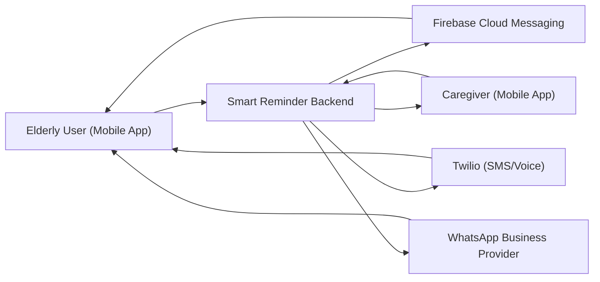
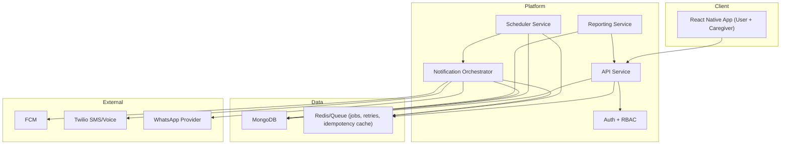

# Architecture Spec (ARS)

## 1. Document Control
- Product: Smart Medication, Health & Hydration Reminder System
- Version: 0.1 (Draft)
- Status: Review Required
- Date: 2026-04-08
- Input Baseline: `specs/PRODUCT_REQUIREMENTS_SPEC.md` v0.2

## 2. Scope Alignment
This architecture covers MVP requirements:
1. Medication reminders
2. Hydration reminders
3. Medication refill reminders
4. Multi-channel fallback notifications (push, SMS, WhatsApp, voice)
5. Confirmation and adherence tracking
6. Family dashboard and escalation

Excluded in this architecture:
1. OCR and camera AI features
2. Clinical decision support

## 3. Architecture Goals
1. Preserve reminder reliability and timing guarantees.
2. Keep medication and hydration as independent operational paths.
3. Ensure fallback channels and escalation policies are configurable.
4. Maintain complete auditability of reminders, confirmations, and misses.
5. Support elderly-friendly low-friction confirmation flows.

## 4. System Context


## 5. Container View


## 6. Service Boundaries

### 6.1 API Service
Responsibilities:
1. User profile and caregiver link management.
2. Medication definitions, schedules, and stock updates.
3. Hydration plan configuration and intake logs.
4. Reminder policy configuration.
5. Confirmation endpoints and dashboard read APIs.

Owns:
1. Request validation and business rules.
2. API authn/authz enforcement.
3. Idempotent write APIs for mobile retries.

### 6.2 Scheduler Service
Responsibilities:
1. Generate due events for medication schedules.
2. Generate due events for hydration intervals.
3. Generate low-stock/refill reminders.
4. Publish due events into queue for notification orchestration.

Isolation requirement:
1. Medication and hydration due-event generation run in separate workers/queues.
2. Failure in one worker does not pause the other.

### 6.3 Notification Orchestrator
Responsibilities:
1. Resolve escalation policy by event type (medication/hydration/refill).
2. Dispatch push as primary channel.
3. Apply timed fallback to SMS/WhatsApp/voice based on policy.
4. Persist per-attempt delivery logs.
5. Trigger caregiver alerts for configured miss/critical conditions.

### 6.4 Reporting Service
Responsibilities:
1. Daily medication adherence metrics.
2. Daily hydration completion metrics.
3. Weekly split reports for medication and hydration.
4. Delivery reliability reports and refill-risk reports.

### 6.5 Auth + RBAC
Responsibilities:
1. Identity and session/token validation.
2. Role separation between user and caregiver.
3. Consent checks for caregiver visibility and alerts.

## 7. Independent Operational Paths

### 7.1 Path A: Medication
1. Schedule is saved in API.
2. Scheduler computes due dose event.
3. Notification Orchestrator sends push notification.
4. If not confirmed in grace window, fallback channels are attempted.
5. Dose action updates adherence counters.
6. Stock model recalculates remaining quantity.
7. Refill alert may trigger for low stock.
8. Caregiver escalation applies for missed critical medication.

### 7.2 Path B: Hydration
1. Hydration plan is saved in API.
2. Scheduler computes interval due event inside active window.
3. Notification Orchestrator sends hydration reminder.
4. User logs intake quantity.
5. Daily hydration progress updates.
6. Hydration-specific escalation applies only on repeated misses.

Path isolation controls:
1. Separate queue topics: `medication_due`, `hydration_due`, `refill_due`.
2. Separate worker pools and circuit breakers for medication and hydration jobs.
3. Independent dead-letter queues for each path.

## 8. Data Model (MongoDB)

### 8.1 Collections
1. `users`
2. `caregiver_links`
3. `medications`
4. `medication_schedules`
5. `dose_events`
6. `hydration_plans`
7. `hydration_events`
8. `refill_events`
9. `reminder_events`
10. `delivery_attempts`
11. `confirmation_events`
12. `escalation_policies`
13. `weekly_reports`
14. `audit_logs`

### 8.2 Key Index Strategy
1. `dose_events`: `(user_id, due_at_utc, status)` compound index.
2. `hydration_events`: `(user_id, due_at_utc, status)` compound index.
3. `reminder_events`: unique `(event_id)` for idempotency.
4. `delivery_attempts`: `(reminder_event_id, attempt_no)` unique.
5. `medications`: `(user_id, is_active, next_refill_at_utc)` for refill scanning.
6. `caregiver_links`: `(caregiver_user_id, dependent_user_id)` unique.

### 8.3 Event State Model (Simplified)
`PENDING -> SENT -> ACKED | SNOOZED | SKIPPED | MISSED`

## 9. Internal Event Contracts (Draft)

### 9.1 Reminder Due Event
```json
{
  "event_id": "uuid",
  "event_type": "MEDICATION_DUE | HYDRATION_DUE | REFILL_DUE",
  "user_id": "uuid",
  "due_at_utc": "2026-04-08T14:30:00Z",
  "timezone": "Asia/Kolkata",
  "policy_id": "uuid",
  "payload": {
    "medication_id": "uuid",
    "schedule_id": "uuid",
    "hydration_plan_id": "uuid",
    "remaining_stock": 12
  }
}
```

### 9.2 Confirmation Event
```json
{
  "event_id": "uuid",
  "source": "LOCKSCREEN | APP_SCREEN | VOICE_IVR",
  "action": "CONFIRM | SNOOZE | SKIP",
  "acted_at_utc": "2026-04-08T14:31:12Z",
  "actor_user_id": "uuid"
}
```

## 10. External Notification Adapter Contract

Adapter interface:
1. `send(message, destination, metadata) -> provider_message_id`
2. `get_delivery_status(provider_message_id) -> status`
3. `normalize_error(provider_error) -> canonical_error_code`

Channel-specific requirements:
1. Push adapter must support deep-link payload for one-tap confirmation.
2. SMS adapter must support short actionable message format.
3. WhatsApp adapter must support approved template IDs.
4. Voice adapter must support DTMF capture for "Press 1 to confirm".

## 11. Failure Handling Strategy

### 11.1 Reliability Controls
1. Idempotency keys on all event writes and dispatch jobs.
2. Exponential backoff retries with max-attempt caps per channel.
3. Dead-letter queues for poison messages.
4. Replay tool for failed jobs with operator approval.

### 11.2 Failure Scenarios
1. Provider outage:
- Action: switch to next fallback channel and log provider outage incident.

2. Queue lag spike:
- Action: autoscale worker pool and prioritize medication jobs over hydration.

3. Mobile offline confirmation:
- Action: client queues action locally; server accepts idempotent late sync.

4. Partial DB outage:
- Action: disable non-critical report generation; preserve reminder flow path.

## 12. Security and Privacy Baseline
1. TLS for all external and internal API communication.
2. Role-based access checks for caregiver data.
3. Field-level masking for sensitive values in logs.
4. Audit logging for caregiver view access and critical status changes.
5. Retention policy for events and reports with deletion workflow support.

## 13. Observability and SLOs
Core metrics:
1. Reminder generation success rate.
2. Dispatch latency by reminder type.
3. Channel success rate and fallback rate.
4. Missed-event rate by medication/hydration.
5. Refill alert lead-time accuracy.

Alert thresholds:
1. Generation success < 99.5% (rolling monthly).
2. Dispatch start latency > 60 seconds (p95).
3. Channel provider error > 5% over 15 minutes.

## 14. Deployment and Environments
1. Environments: `dev`, `staging`, `prod`.
2. Blue/green or rolling deploy for API and workers.
3. Feature flags for channel rollout and escalation policy experiments.
4. Separate credentials and webhook secrets per environment.

## 15. ADR Mapping
1. ADR-001: FastAPI vs Node.js backend runtime.
2. ADR-002: Queue and scheduler strategy.
3. ADR-003: Notification retry/fallback policy.
4. ADR-004: Offline confirmation synchronization.
5. ADR-005: Event storage and adherence history model.

## 16. Review Checkpoint
Approval required before creating:
1. `specs/ADR-001.md` to `specs/ADR-005.md`
2. API contract spec in `specs/` (OpenAPI)
3. Scheduler schema spec in `specs/`
